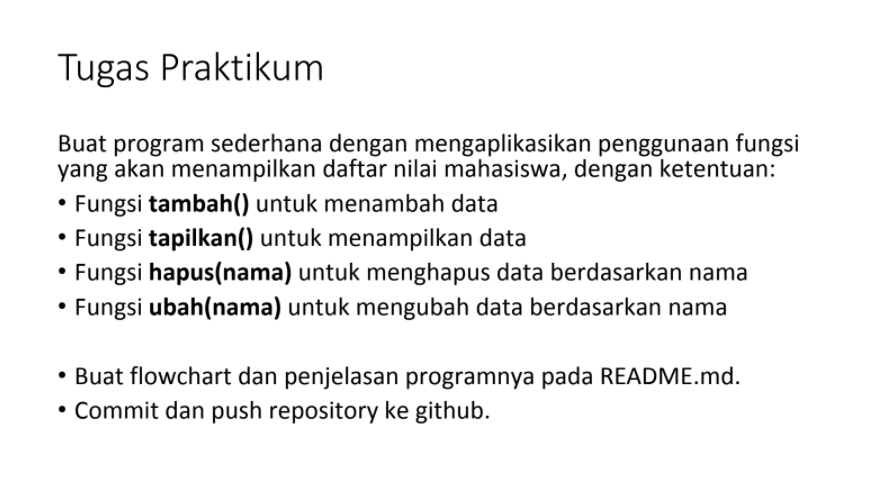

# tugas-pertemuan-ke-11

# jawab
# mengubah menjadi lambda
1. ```a = lambda x: (x**2) ```

2. ```b = lambda x,y math.sqrt ```

3. ```c = lambda *args:sum(args)/len(args) ```

4. ```d = lambda s : "".join(set(s)) ```
berikut tampilan program dan outputnya di visual studio\


# praktikum

# jawab
flowchart \
 \
program\
 \
\
penjelasan program : 
1. membuat looping 
```
while True:
    c = input('tambah? tampilkan? hapus? ubah?: ')
```
2. membuat if dan function: \
```
if c == ('tambah'):
        def tambah():
            print('tambah mahasiswa: ')
            nama = input("masukan nama: ")
            nim = input('masukan nim: ')
            nilaitugas = int(input('masukan nilai tugas: '))
            nilaiuts = int(input('masukan nilai uts: '))
            nilaiuas = int(input('masukan nilai uas: '))
            nilaiakhir = (0.30 * nilaitugas) + (0.35 * nilaiuts) + (0.35 * nilaiuas)
            data[nama]= nim,nilaitugas,nilaiuts,nilaiuas,nilaiakhir
```
3. elif dan function tampilkan: 
```
elif c == ('tampilkan'):
        if data.items():
            def tampilkan():
             print("\n                      DAFTAR NILAI MAHASISWA                    ")
             print("==================================================================")
             print("| No |     Nama     |    NIM    | Tugas |  UTS  |  UAS  |  Akhir |")
             print("==================================================================")
             i = 0
             for x in data.items():
                 i += 1
                 print(f"""| {i}  |     {x[0]}    | {x[1][0]} |   {x[1][1]}  |  {x[1][2]}  |  {x[1][3]}    |  {x[1][4]}  |""")
            tampilkan()
```
4. elif dan fuction hapus : 
```
elif c == ("hapus"):
        def hapus():
         nama = input('masukan nama yang akan dihapus: ')
         if nama in data.keys():
             del data[nama]
             print('data telah dihapus!')
         else:
             print("data mahasiswa tidak terdaftar")
        hapus()
```
5. elif dan fuction ubah: 
```
elif c == ('ubah'):
        def ubah():
         print('mengubah data mahasiswa')
         nama = input('masukan nama: ')
         if nama in data.keys():
             nim = input('masukan nim baru')
             nilaitugas = int(input('masukan nilai tugas: '))
             nilaiuts = int(input('masukan nilai uts: '))
             nilaiuas = int(input('masukan nilai uas: '))
             nilaiakhir = (0.30 * nilaitugas) + (0.35 * nilaiuts) + (0.35 * nilaiuas)
             data[nama]= nim,nilaitugas,nilaiuts,nilaiuas,nilaiakhir
             print("data berhasil di perbarui!")
```

berikut adalah outputnya memanggil fuction tambah: \
 \
ouput dari tampilkan: \
 \
output dari hapus dan ubah: \


